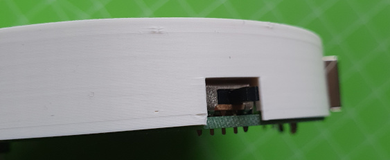
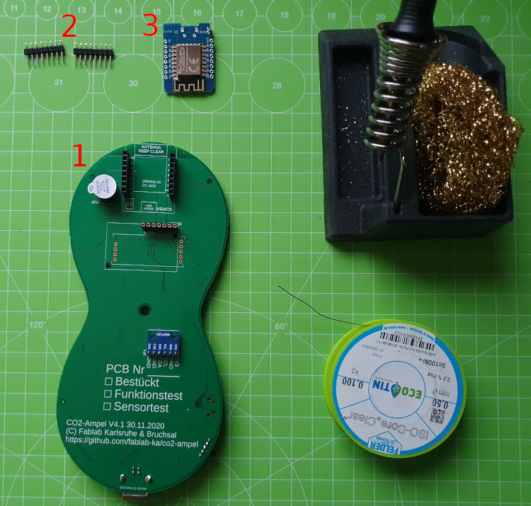
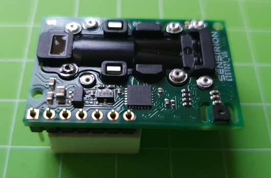

# CO2-Ampel Lötanleitung - PCB v4.1

## Vorbereitung
Den D1 Mikrocontroller könnt ihr schon vorab mit dem Arduino Programm flashen. Dann könnt ihr direkt nach dem Löten die Ampel testen.

Prüft bitte bevor ihr beginnt, ob ihr alle benötigten Teile und Werkzeuge habt:

## Benötige Bauteile
* Buchse 8pin (2x): Diese findet ihr beim D1 Mikrocontroller
* Buchse 7pin (1x)
* bmp280 Platine
* Stiftleiste 6pin (1x): Diese findet ihr bei der bmp280 Platine
* Stiftleiste 8pin (2x): Diese findet ihr beim D1 Mikrocontroller
* D1 Mikrocontroller
* Buzzer (1x)
* SMD bestückte Platine
* USB-Buchse
* Schalter
* scd30 CO2-Sensor
* Stiftleiste 7pin
* USB-Netzteil
* USB-Kabel (A-Stecker auf B-Stecker)

## Benötigtes Werkzeug
* 3D-gedruckte Löthilfe für die Platine
* 3D-gedruckte Löthilfe für den scd30
* Lötstation (temperaturgeregelt)
* Lötrauchabsaugung
* Lötzinn (bleifrei 0.5-0.75mm Durchmesser)
* Seitenscheider
* Multimeter
* Erdungsarmband
* evtl. eine Entlötpumpe, falls doch mal ein Bauteil falsch eingelötet wurde

## Teil I: Stiftleisten, Sockel und Buzzer

### Benötigte Bauteile
1. Buchse 8pin (2x): Diese findet ihr beim D1 Mikrocontroller
2. Buchse 7pin (1x)
3. Stiftleiste 6pin (1x): Diese findet ihr bei der bmp280 Platine
4. Buzzer (1x)
5. SMD bestückte Platine

### Benötigtes Werkzeug
* 3D-gedruckte Löthilfe für die Platine
* Lötstation (temperaturgeregelt)
* Lötrauchabsaugung
* Lötzinn (bleifrei 0.5-0.75mm Durchmesser)

### Arbeitsschritte
1. Setzt die beiden 8pin Buchsen in die Löthilfe ein (a+b)
2. Setzt die 7pin Buchse in die Löthilfe ein (c)
3. Setzt die 6pin Stiftleiste in die Löthilfe ein (d). **WICHTIG:** Die kurzen Beinchen schauen nach oben raus.
4. Buzzer auf die Platine stecken (auf der Seite **ohne** LEDs). Falls der Buzzer beim Drehen der Platine abfällt, dann die Beinchen leicht zusammen drücken und dann nochmals einstecken. **WICHTIG:** Achtet hier auf die richtige Polarität. (+ auf dem Buzzer zu + auf der Platine).

5. Platine vorsichtig auf die Löthilfe stecken. Evtl. etwas rütteln, so dass die Stiftleisten in die Löcher der Platine rutschen. Wenn alles passt, dann die Platine fest in die Löthilfe drücken, so dass die Ränder bündig sind. 

6. Jetzt könnt ihr alle Pins anlöten. Achtet darauf, dass ihr den Lötkolben nur max 2-3 Sekunden an die Lötstelle haltet. 
7. **Qualitätskontrolle:** Das ist der wichtigste Schritt und erspart euch später viel Zeit bei der Fehlersuche. Prüft nochmals alle Lötstellen und schaut nochmal, ob ihr wirklich **kein Bauteil oder Pin vergessen** habt. Die **Lötstellen** sollten **glatt und leicht konisch** sein. Wenn sie rau sind, habt ihr vermutlich eine kalte Lötstelle. Dann solltet ihr das Lötzinn nach einer kurzen Abkühlphase nochmals erhitzen. Prüft zur Sicherheit noch einmal, dass **keine Lötstellen miteinander verbunden** sind. Das kann später einen Kurzschluss verursachen und im schlimmsten Fall die Bauteile zerstören.

## Teil II: USB-Buchse und Schalter

### Benötigte Bauteile
1. Platine aus Teil I
2. USB-Buchse
3. Schalter

### Benötigtes Werkzeug
* 3D-gedruckte Löthilfe für die Platine
* Lötstation (temperaturgeregelt)
* Lötrauchabsaugung
* Lötzinn (bleifrei 0.5-0.75mm Durchmesser)

### Arbeitsschritte
Auf der Platine sind die Positionen der Bauteile weiß markiert. Achtet bitte vor allem in diesem Teil darauf, dass ihr die Bauteile auf der richten Seite auf die Platine steckt.
1. USB-Buchse auf die Platine stecken (auf der Seite **mit** den LEDs)
2. Schalter auf die Platine stecken (auf der Seite **mit** den LEDs)

3. Platine in Löthilfe einlegen und wieder fest andrücken, so dass die Ränder bündig sind

4. USB-Buchse Befestigung (a) anlöten: Hier braucht ihr viel Lötzinn. Am schnellsten geht es, wenn ihr hier 1-2mm dickes Lötzinn verwendet. Falls ihr nur dünnes habt, dann am besten etwas Zinn auf der flachen Seite der Lötspitze sammeln und erst dann die Lötspitze an die Lötstelle halten. Hier ist es ok, wenn ihr die Lötspitze 4-5 Sekunden an die Lötstelle haltet. Bitte aber nicht länger, denn sonst erhitzt sich die Abschirmung zu stark und das Plastik schmilzt. Die Buchse nochmal auszulöten macht keinen Spaß.

5. Jetzt könnt ihr die restlichen Pins anlöten. Die 4 Pins der USB Buchse sitzen recht eng beeinander. Dreht euch am besten die Platine immer so, dass ihr bequem von außen die Lötspitze ansetzen könnt.
6. **Qualitätskontrolle:** Auch nach diesem Schritt bitte nochmal alle Lötstellen wie oben beschrieben prüfen. 

## Teil III: bmp280 Zusatzplatine

### Benötigte Bauteile
1. Platine aus Teil II
2. bmp280 Platine

### Benötigtes Werkzeug
* 3D-gedruckte Löthilfe für die Platine
* Lötstation (temperaturgeregelt)
* Lötrauchabsaugung
* Lötzinn (bleifrei 0.5-0.75mm Durchmesser)
* Seitenschneider

### Arbeitsschritte
1. Legt die kleine Platine so wie auf dem Bild zu sehen, auf die Stiftleiste. **WICHTIG:** Prüft hier nochmals, ob sie richtig herum platziert wurde (**3.3V = VCC**).

2. Haltet die kleine Platine waagerecht und lötet den ersten Pin. Wenn das Lötzinn kalt ist, könnt ihr die Platine los lassen und nochmal prüfen, ob sie waagerecht sitzt.
3. Kürzt mit einem Seitenschneider die Stiftleiste. Die Pins sollten 1-2mm raus stehen. Das vereinfacht eucht später das Löten. Wenn ihr keinen Seitenschneider habt, könnt ihr diesen Schritt aber auch überspringen.
4. Lötet die restlichen Pins
5. **Qualitätskontrolle:** Auch nach diesem Schritt bitte nochmal alle Lötstellen wie oben beschrieben prüfen. 

## Teil IV: D1 Mikrocontroller

### Benötigte Bauteile
1. Platine aus Teil III
2. 8pin Stiftleisten (2x): Diese findet ihr beim D1 Mikrocontroller
3. D1 Mikrocontroller

### Benötigtes Werkzeug
* Lötstation (temperaturgeregelt)
* Lötrauchabsaugung
* Lötzinn (bleifrei 0.5-0.75mm Durchmesser)

### Arbeitsschritte
1. Steckt die beiden 8pin Stiftleisten in die Buchsen (a+b). **WICHTIG:** Die kurzen Enden schauen nach oben raus.
2. Legt den Mikrocontroller ein und achtet darauf, dass er richtig herum platziert ist. Die Antenne muss nach außen und die Mikro-USB Buchse des Controllers nach innen schauen. Auf der Platine ist dies auch in weiß eingezeichnet.
3. Drückt den Mikrocontroller auf die Stiftleiste und lötet zunächst die 4 äußeren Pins. 
4. Jetzt könnt ihr ihn loslassen und die restlichen Pins anlöten. Auch hier wieder die Platine so drehen, dass ihr von außen die Lötspitze ansetzen könnt.
5. **Qualitätskontrolle:** Auch nach diesem Schritt bitte nochmal alle Lötstellen wie oben beschrieben prüfen. 

## Schritt V - Platine prüfen
### Benötigte Bauteile
1. Platine aus Schritt IV

### Benötigtes Werkzeug
* Multimeter

### Arbeitsschritte

## Schritt VI - CO2-Sensor

### Benötigte Bauteile
1. geprüfte Platine aus Schritt V
2. Stiftleiste 7pin
3. scd30 CO2-Sensor

### Benötigtes Werkzeug
* 3D-gedruckte Löthilfe für den scd30
* Lötstation (temperaturgeregelt)
* Lötrauchabsaugung
* Lötzinn (bleifrei 0.5-0.75mm Durchmesser)
* Erdungsarmband

### Arbeitsschritte
Der Sensor ist das teuerste Bauteil und sehr empfindlich. Wenn ihr hier zu lange an einer Stelle lötet oder mit der heißen Lötspitze eines der SMD-Bauteile auf der Platine  berührt, könnt ihr ihn irreparabel beschädigen.

Der Sensor ist außerdem empfindlich gegen elektrostatische Aufladung. Ihr solltet daher bei diesem Schritt ein **Erdungsarmband tragen** und ihn nur am Rand anfassen.
1. Stiftleiste in die Löthilfe stecken (kurze Beine schauen raus)

2. Sensor einlegen (es gibt nur eine Position die passt). Vorsichtig andrücken.

3. Pins vorsichtig löten
4. **Qualitätskontrolle:** Auch nach diesem Schritt bitte nochmal alle Lötstellen wie oben beschrieben prüfen. 
5. Sensor auf die Platine stecken. Hier müsst ihr unbedingt darauf achten, dass der Sensor richtig sitzt und alle PINs im Header stecken. **Wenn ihr ihn nur um ein PIN versetzt einsteckt, wird er beim Einschalten sofort zerstört.**

## Schritt VII - Test der Ampel

### Benötigte Bauteile
2. geprüfte Platine aus Schritt VI
3. USB-Netzteil
3. USB-Kabel (A-Stecker auf B-Stecker)

### Arbeitsschritte
1. Schutzaufkleber auf dem Buzzer entfernen
2. CO2-Ampel mit dem Kabel an das Netzteil anschließen
3. Selbsttest abwarten. Wenn alles richtig gemacht wurde, leuchten zuerst alle LEDs kurz weiß und blinken dann grün. 
4. CO2-Sensor leicht anpusten. Er sollte nach ein paar Sekunden auf gelb/rot springen und der Buzzer sollte zu hören sein. 
5. Wenn der Selbsttest erfolgreich war und auch der buzzer funktioniert, könnt ihr die Ampel fertig zusammen bauen und dann direkt einsetzen.

Wir hoffen es hat alles geklappt und ihr hattet Spaß beim Löten. Wenn es Probleme gibt oder ihr unsicher seid, dann meldet euch gerne bei uns.

### Eure FabLabs Karlsruhe & Bruchsal

