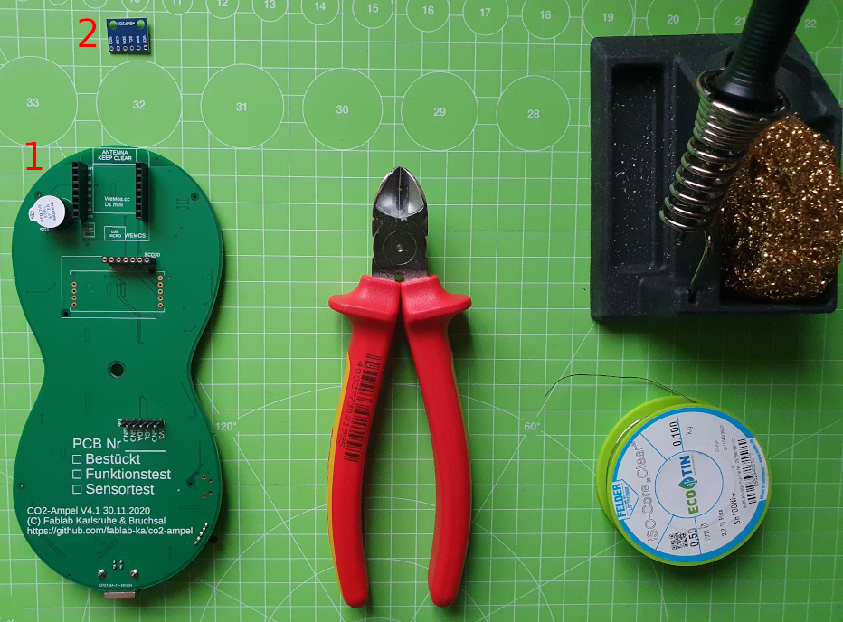
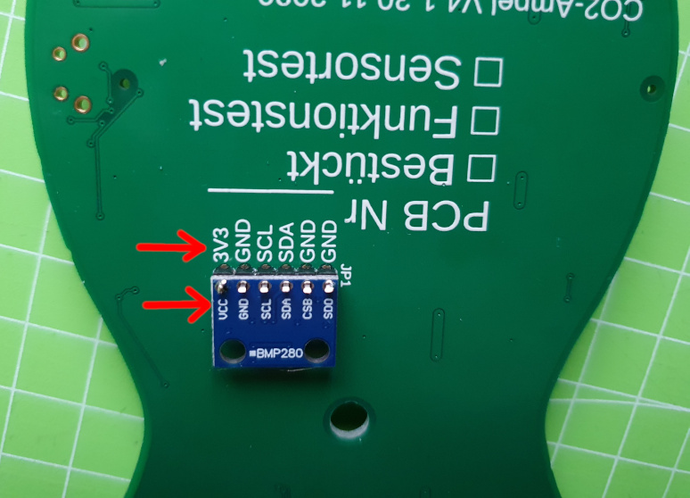

# CO2-Ampel Lötanleitung - PCB v4.1

## Teil III: bmp280 Zusatzplatine

### Benötigte Bauteile
1. Platine aus Teil II
2. bmp280 Platine

### Benötigtes Werkzeug
* 3D-gedruckte Löthilfe für die Platine
* Lötstation (temperaturgeregelt)
* Lötrauchabsaugung
* Lötzinn (bleifrei 0.5-0.75mm Durchmesser)
* Seitenschneider

### Arbeitsschritte
1. Legt die kleine Platine so wie auf dem Bild zu sehen, auf die Stiftleiste. **WICHTIG:** Prüft hier nochmals, ob sie richtig herum platziert wurde (**3.3V = VCC**).

2. Haltet die kleine Platine waagerecht und lötet den ersten Pin. Wenn das Lötzinn kalt ist, könnt ihr die Platine los lassen und nochmal prüfen, ob sie waagerecht sitzt.
3. Kürzt mit einem Seitenschneider die Stiftleiste. Die Pins sollten 1-2mm raus stehen. Das vereinfacht eucht später das Löten. Wenn ihr keinen Seitenschneider habt, könnt ihr diesen Schritt aber auch überspringen.
4. Lötet die restlichen Pins
5. **Qualitätskontrolle:** Auch nach diesem Schritt bitte nochmal alle Lötstellen wie oben beschrieben prüfen. 

